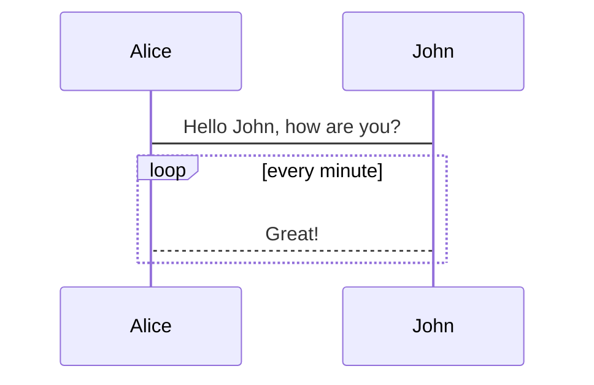
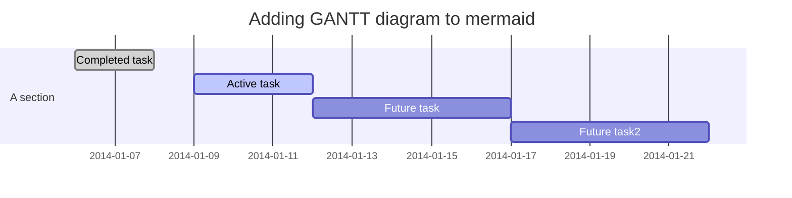

以下是使用中的hexo插入mermaid diagrams的方法。
感谢做插件的人！

[github参考link](https://github.com/webappdevelp/hexo-filter-mermaid-diagrams)

[Mermaid diagrams介绍gitbook](https://mermaidjs.github.io/)

## 安装插件

```
npm install hexo-filter-mermaid-diagrams
```

## 修改配置文件
在hexo的`_config.yml`文件（根目录的并非主题的）中，添加以下内容：

```
# mermaid chart
mermaid: ## mermaid url https://github.com/knsv/mermaid
  enable: true  # default true
  version: "7.1.2" # default v7.1.2
  options:  # find more api options from https://github.com/knsv/mermaid/blob/master/src/mermaidAPI.js
    #startOnload: true  // default true
```
## js文件修改

1. 修改位置 （next主题为例）
`themes/next/layout/_partials/footer.swig`

1. 根据footer的格式不同，添加的内容不同。
格式有`after_footer.pug` , `after-footer.ejs` ,`footer.swig`等。
以下在next的`footer.swig`添加的内容。其他格式参考[github: hexo-filter-mermaid-diagrams](https://github.com/webappdevelp/hexo-filter-mermaid-diagrams)

```

  <script src='https://unpkg.com/mermaid@{{ theme.mermaid.version }}/dist/mermaid.min.js'></script>
  <script>
    if (window.mermaid) {
      mermaid.initialize({{ JSON.stringify(theme.mermaid.options) }});
    }
  </script>

```

到此为止，设置的部分就结束了。

## 语法
语法要稍微注意一下。

有一些markdown的编辑工具，比如 Cmd Markdown，mermaid的语法是这样的：
````
```sequence
    Alice->John: Hello John, how are you?
    loop every minute
        John-->Alice: Great!
    end
```
````

注意使用这款插件的语法略有不同，
- 三个点后面要写的是mermaid，而不是sequence,graph TD等mermaid diagram具体类型。
- 在内容的第一行写sequence,graph TD等mermaid diagram具体类型。
````
` ` `mermaid
graph TD;
    A-->B;
    A-->C;
    B-->D;
    C-->D;
` ` `
````
<i class="fa fa-thumb-tack" style="font-size:1em;"></i>  *mermaid前和最后的的三个点之间加了空格，显示效果时需要去掉空格*

## 效果

至此已经完成了mermaid设定，在环境中也可以正常使用了。
此时效果：


不需要更换背景颜色的话，执行`hexo g`,`hexo d`就完成了。

可以看出效果背景是灰色的。
像我一样想换一个背景颜色的话，继续下一小节。

## 个性化背景颜色
个人希望没有背景颜色，是透明的。
hexo有供用户设置的css文件。需要在这里添加需要的css内容。
- 文件位置（next主题为例）
`themes\next\source\css\_custom\custom.styl`
- 添加内容
```
.mermaid {
 background: transparent;
}
```

- 效果

mermaid流程图*mermaid flowchart*


序列图*sequence diagram*


甘特图*gantt diagram*


更换css时，部署前有时需要先clean一下（不知道是不是bug）。
所以执行`hexo clean`，`hexo g`，`hexo d`完成部署。